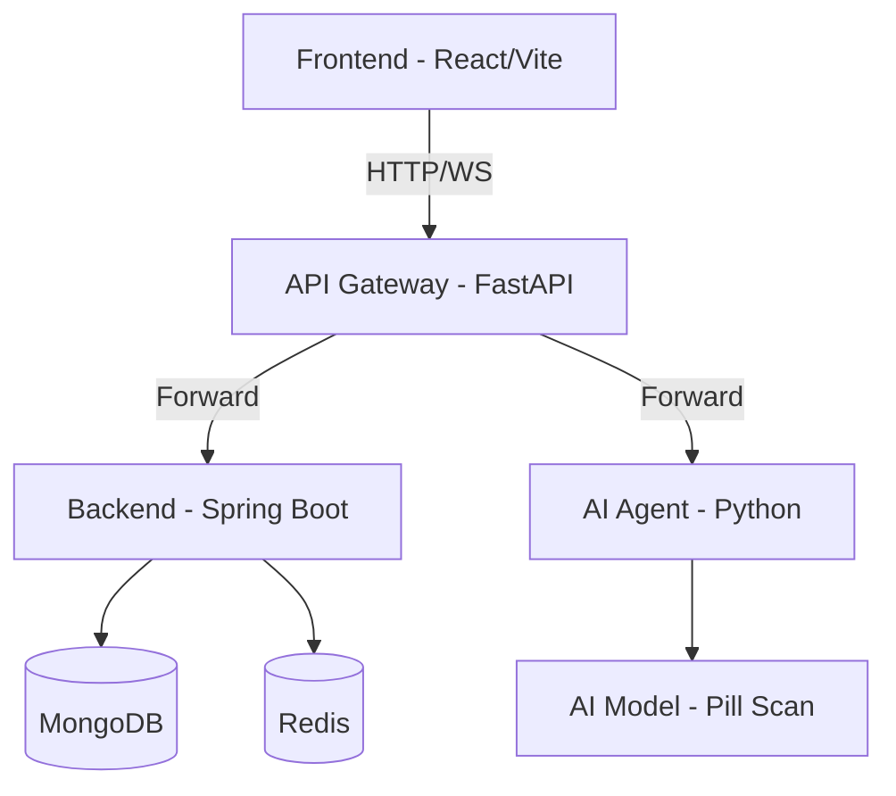

# PharmAgent - Hệ thống lên lịch và quản lý thuốc cho người cao tuổi

# I. Mở đầu
## 1. Lý do chọn đề tài.

Trong những năm gần đây, cùng với sự già hóa dân số toàn cầu, công nghệ y tế (HealthTech) đang trở thành một trong những lĩnh vực công nghệ thu hút sự quan tâm đặc biệt. Đối với người cao tuổi, việc mắc các bệnh lý nền và phải sử dụng nhiều loại thuốc với lịch trình phức tạp là rất phổ biến. Tuy nhiên, sự suy giảm trí nhớ và những hạn chế về mặt thể chất thường dẫn đến tình trạng quên uống thuốc, uống sai liều hoặc nhầm lẫn thuốc — gây ra những hậu quả nghiêm trọng đối với quá trình điều trị. Việc chuyển đổi từ các phương pháp nhắc nhở thủ công (như hộp chia thuốc, ghi chép giấy) sang các nền tảng kỹ thuật số thông minh là một nhu cầu cấp thiết để kết nối hiệu quả giữa bệnh nhân, người chăm sóc và hệ thống y tế.

Đặc điểm kỹ thuật của một hệ thống quản lý y tế cá nhân đặt ra nhiều bài toán phức tạp, đòi hỏi sự kết hợp của nhiều kiến trúc phần mềm hiện đại:

* **Về tính kịp thời và độ tin cậy của luồng thông báo:** Tính mạng và sức khỏe người dùng phụ thuộc vào việc hệ thống gửi lời nhắc uống thuốc phải chính xác đến từng phút. Việc điều phối và phát đi hàng ngàn thông báo đồng thời đòi hỏi hệ thống phải có cơ chế xử lý tác vụ bất đồng bộ (asynchronous processing) và sử dụng các hệ thống điều phối thông điệp (Message Broker) mạnh mẽ để không làm tắc nghẽn luồng xử lý chính của máy chủ.
* **Về tính linh hoạt trong quản lý dữ liệu:** Hồ sơ bệnh án, chi tiết đơn thuốc và lịch sử tuân thủ điều trị là những tập dữ liệu có tính đa dạng cao và liên tục mở rộng. Hệ thống yêu cầu một giải pháp cơ sở dữ liệu có khả năng mở rộng tốt, xử lý linh hoạt các cấu trúc dữ liệu phức tạp để lưu trữ và truy xuất thông tin bệnh nhân với hiệu năng cao.
* **Về bảo mật và xác thực danh tính:** Dữ liệu y tế và lịch sử dùng thuốc là những thông tin cá nhân cực kỳ nhạy cảm. Quá trình đăng nhập và thao tác trên hệ thống đòi hỏi các cơ chế bảo mật nghiêm ngặt, như xác thực đa yếu tố (MFA) hay mã xác thực một lần (OTP), đồng thời yêu cầu hệ thống phân quyền rõ ràng giữa các vai trò khác nhau như người dùng cao tuổi, người nhà (người giám hộ) và bác sĩ.

Nhóm lựa chọn đề tài xây dựng nền tảng **PharmAgent** vì đây là một bài toán thực tiễn mang tính nhân văn cao, đồng thời tạo ra một bối cảnh ứng dụng hoàn hảo để tổng hợp các kiến thức chuyên ngành: từ việc thiết kế luồng người dùng (User Flow), xây dựng RESTful API, quản trị cơ sở dữ liệu, đến xử lý bảo mật. Hơn thế nữa, đề tài cho phép nhóm trực tiếp làm quen và giải quyết các bài toán ở quy mô hệ thống doanh nghiệp (Enterprise Architecture) như tích hợp Message Queue, thiết kế dịch vụ chạy ngầm (Background Jobs) và triển khai các luồng xác thực an toàn.

## 2. Mục tiêu dự án

Dự án của chúng ta là **PharmAgent** — một hệ thống hỗ trợ y tế (HealthTech) tập trung vào người cao tuổi. với 4 mục tiêu kỹ thuật chính:

### Mục tiêu 1: Hệ thống quản lý và nhắc nhở uống thuốc thông minh
Xây dựng pipeline nhắc nhở tin cậy: từ việc thiết lập lịch trình đơn thuốc phức tạp, xử lý các tác vụ chạy ngầm (**Background Jobs**) để điều phối thông báo, đến việc gửi tín hiệu thời gian thực qua **WebSocket**. Hệ thống phải đảm bảo tính kịp thời (chính xác đến từng phút) và cho phép người dùng xác nhận, theo dõi lịch sử tuân thủ điều trị.

### Mục tiêu 2: Trợ lý AI nhận diện thuốc thời gian thực (Pill Scan)
Xây dựng **AI Agent** xử lý luồng dữ liệu hình ảnh/video từ camera để nhận diện các loại thuốc. Sử dụng kết nối **WebSocket** để truyền tải frame ảnh và trả về kết quả nhận diện (tên thuốc, hàm lượng, công dụng) với độ trễ thấp. Tích hợp lưu trữ hình ảnh nhận diện lên đám mây (**Cloudinary**) để làm bằng chứng tuân thủ.

### Mục tiêu 3: Hệ thống kết nối và giám sát Caregiver - Elderly
Xây dựng tính năng kết nối đa chiều giữa người cao tuổi và người chăm sóc (Caregiver). Đảm bảo sự đồng bộ trạng thái giữa các vai trò: người chăm sóc có thể quản lý danh mục thuốc, theo dõi việc uống thuốc của người thân từ xa và nhận cảnh báo tức thời nếu có sự cố hoặc quên liều.

### Mục tiêu 4: Kiến trúc Microservices và Bảo mật dữ liệu y tế
Triển khai hệ thống dựa trên kiến trúc **Microservices** hiện đại:
*   **API Gateway (FastAPI)**: Đóng vai trò cửa ngõ, xử lý xác thực tập trung, Rate Limiting và định tuyến.
*   **Backend (Spring Boot)**: Xử lý logic nghiệp vụ nặng và quản lý dữ liệu trên **MongoDB/MySQL**.
*   **Bảo mật**: Quản lý phiên bằng **JWT**, phân quyền **RBAC** nghiêm ngặt (Admin/Caregiver/Elderly) để bảo vệ dữ liệu y tế nhạy cảm của người dùng.

Hệ thống PharmAgent là giải pháp microservices hỗ trợ người cao tuổi theo dõi lịch uống thuốc, nhận diện thuốc qua AI và kết nối với người thân (caregiver).

## 3. Quy trình phối hợp và quản lý mã nguồn.

### 3.1. Gitflow
| Tên nhánh | Vai trò | 
| -- | -- | 
| `main` | Môi trường production - nhánh chứa mã nguồi cuối cùng cho môi trường sản phẩm |
| `dev` | Môi trường staging - nhánh dùng để tổng hợp code, kiểm thử trước khi đưa lên production | 
| `feat/cms-service` | Nhánh phát triển module quản lý nội dung |
| `feat/agent-service` | Nhánh phát triển module AI nhận diện thuốc |
| `feat/chat-service` | Nhánh phát triển module chat và thông báo thời gian thực |
| `feat/schedule-service` | Nhánh phát triển module quản lý lịch uống thuốc |
| `feat/frontend` | Nhánh phát triển giao diện người dùng (React) |
| `feat/api-gateway` | Nhánh phát triển API Gateway (FastAPI) |
| `feat/infrastructure` | Nhánh phát triển hạ tầng, Docker, CI/CD |

**Quy trình làm việc:**
1. Mỗi thành viên sẽ tạo nhánh riêng từ `dev` để phát triển tính năng mới hoặc sửa lỗi.
2. Sau khi hoàn thành, tạo Pull Request (PR) từ nhánh tính năng vào `dev` để được review và kiểm thử.
3. Sau khi PR được duyệt và merge vào `dev`, tiến hành kiểm thử tích hợp toàn bộ trên môi trường staging.
4. Khi mọi thứ ổn định, merge `dev` vào `main` để triển khai lên production.

### 3.2. Docker compose
Một trong những khó khăn phổ biến khi nhiều người cùng phát triển một hệ thống là
sự sai lệch về môi trường giữa các máy thành viên: khác phiên bản thư viện, khác cấu hình cơ
sở dữ liệu, hoặc thiếu dịch vụ phụ trợ. Để giải quyết vấn đề này, nhóm sử dụng Docker
Compose để định nghĩa và khởi chạy toàn bộ hệ thống như một tập hợp các container nhất
quán.

| Service | Image/Build | Port | Mô tả |
| -- | -- | -- | -- |
| `database` | `mongo:7` | 27017 | Cơ sở dữ liệu MongoDB, khởi tạo qua `init.sql` |
| `redis` | `redis:7-alpine` | 6379 | Hệ thống cache và message broker |
| `rabbitmq` | `rabbitmq:3-management` | 5672/15672 | Hệ thống message broker cho xử lý bất đồng bộ |
| `pharmagent-agent` | Build từ `./agent/` | 8000 | Dịch vụ AI nhận diện thuốc |
| `pharmagent-backend` | Build từ `./backend/` | 8080 | Dịch vụ backend chính xử lý logic nghiệp vụ |
| `pharmagent-gateway` | Build từ `./gateway/` | 9000 | API Gateway xử lý xác thực và định tuyến |
| `pharmagent-frontend` | Chạy Vite từ `./frontend/` qua bind mount | 5173 | Giao diện người dùng React, tự bám theo source hiện tại |
| `cloudflare` | `cloudflare/cloudflared:2024.6.0` | - | Dịch vụ tunneling để expose local server ra Internet |

Để đảm bảo tính bảo mật, chúng ta chỉ expose các cổng cần thiết ra bên ngoài (ví dụ: 5173 cho frontend, 9000 cho API Gateway) và giữ các dịch vụ nội bộ (database, redis, rabbitmq) chỉ có thể truy cập từ trong mạng Docker.

Với cấu hình này, mọi thành viên chỉ cần cài đặt Docker và chạy lệnh `docker
compose up` để có được một môi trường phát triển đầy đủ, bao gồm cơ sở dữ liệu đã được
khởi tạo dữ liệu mẫu. Frontend chạy bằng Vite trong container Node.js và bind mount trực
tiếp thư mục `./frontend`, nên thay đổi trong source hiện tại được container sử dụng ngay,
không phụ thuộc vào image nginx/static build cũ. Các biến cấu hình nhạy cảm (kết nối cơ sở dữ
liệu, API key) được quản lý qua file .env riêng cho từng service, không được đưa lên repository.

Cloudinary hoạt động như một dịch vụ bên ngoài có chức năng lưu trữ hình ảnh nhận diện thuốc. Các container trong hệ thống sẽ kết nối với Cloudinary qua API để upload và truy xuất hình ảnh, đảm bảo tính linh hoạt và mở rộng của hệ thống.

### 3.3. Kiến trúc hệ thống


### 3.4. Phân chia công việc
- **Module A – UI & Gateway (BFF)**: Sở hữu toàn bộ UI (Elderly/Caregiver/Admin), luồng xác thực ở phía client, WebSocket client, và phần “BFF” ở Gateway (route, auth check, mapping payload). Đầu ra: UI hoàn chỉnh + spec API cần từ backend.
- **Module B – Core Backend (User/Caregiver/Medication/Schedule)**: Sở hữu domain chính (User/Caregiver, thuốc, lịch uống, xác nhận tuân thủ). Thiết kế schema dữ liệu, CRUD, validation, RBAC. Đầu ra: API ổn định + test nghiệp vụ.
- **Module C – AI Agent (Pill Scan)**: Sở hữu dịch vụ AI nhận diện thuốc (WS streaming, xử lý ảnh, trả kết quả, lưu minh chứng). Đầu ra: API/WS spec + service chạy độc lập + tài liệu tích hợp.
- **Module D – Platform & Infra (Async/DevOps)**: Sở hữu hạ tầng (Docker/K8s, CI/CD, cấu hình môi trường, logging/monitoring), cùng pipeline thông báo (message broker, job scheduler/worker). Đầu ra: môi trường dev/staging chạy ổn + cơ chế nhắc thuốc async.

# II. Nền tảng kỹ thuật và công nghệ
## 1. Database
Hệ thống sử dụng **MongoDB** làm cơ sở dữ liệu chính để lưu trữ thông tin người dùng, đơn thuốc, lịch uống và lịch sử tuân thủ. MongoDB được chọn vì khả năng lưu trữ linh hoạt, phù hợp dữ liệu phi cấu trúc và mở rộng tốt. Bên cạnh đó, **Redis** được dùng cho caching và quản lý phiên (session), giúp tăng tốc truy xuất và giảm tải cho MongoDB.

### Thiết kế schema MongoDB
- **User**: thông tin xác thực và trạng thái tài khoản.
- **UserProfile**: hồ sơ chi tiết người dùng (thông tin cá nhân, liên hệ, vai trò).
- **Relationship**: quan hệ caregiver–elderly, quyền truy cập và trạng thái.
- **UserDevice**: thiết bị đăng nhập phục vụ push/notification.
- **Pill**: danh mục thuốc chuẩn (mô tả, đặc điểm, hình ảnh).
- **Medication**: thuốc theo bệnh nhân, liều dùng và lịch uống gắn kèm.
- **EventDose**: nhật ký từng liều uống (lịch hẹn, đã uống/chưa, người xác nhận).
- **Notification**: thông báo giữa người dùng, trạng thái gửi/nhận.
- **ChatRoom**: phòng chat và danh sách thành viên.
- **ChatMessage**: tin nhắn trong phòng chat, trạng thái đã đọc.
- **CallLog**: lịch sử cuộc gọi, thời lượng và trạng thái.


### Các phần embedded trong MongoDB
- **UserProfile → UserContact**: danh bạ/đầu mối liên hệ đi kèm hồ sơ, ít khi truy vấn độc lập.
- **Medication → MedSchedule**: lịch uống là thuộc tính của từng đơn thuốc, không có vòng đời riêng.
- **Pill → PillImage**: ảnh thuốc là metadata phụ trợ, luôn đi cùng thuốc.

### Vì sao chọn embed thay vì tách entity riêng
- **Truy cập cùng lúc**: dữ liệu con thường được đọc chung với dữ liệu cha.
- **Vòng đời phụ thuộc**: dữ liệu con không tồn tại độc lập.
- **Atomic update**: cập nhật một document, tránh đồng bộ nhiều collection.
- **Giảm độ phức tạp**: ít collection và ít truy vấn hơn.

## 2. Redis
- **Vai trò chung**: lưu trữ dữ liệu ngắn hạn, truy cập cực nhanh, phục vụ bảo mật và realtime thay vì “cache dữ liệu nghiệp vụ” truyền thống.
- **JWT blacklist**: lưu token bị thu hồi với TTL bằng thời gian còn sống của token; giúp chặn ngay các token bị logout mà không phải chờ hết hạn.
- **OTP reset mật khẩu**: lưu OTP có TTL ngắn; xác thực xong thì xóa để chống replay; giảm tải DB và tránh lưu dấu vết lâu dài.
- **Trạng thái online**: lưu session/online flag theo user, TTL tự hết hạn; phù hợp realtime nhưng có thể “stale” nếu user rớt kết nối mà không kịp cập nhật.
- **Rate limiting**: dùng bộ đếm theo “cửa sổ thời gian” (fixed window) cho mỗi IP/user; ưu điểm đơn giản, hiệu quả; nhược điểm là ranh giới cửa sổ có thể tạo burst.

## 3. RabbitMQ
- **Vai trò chung**: tách luồng bất đồng bộ khỏi request chính và làm broker realtime cho WebSocket; giúp hệ thống không bị block khi xử lý tác vụ nặng/chậm.
- **OTP email queue**: backend chỉ “đẩy việc gửi mail” vào hàng đợi, worker xử lý nền; nếu worker down, queue giữ lại cho tới khi worker lên lại.
- **STOMP broker relay**: dùng RabbitMQ làm broker cho các kênh `/topic` và `/queue`; `/topic` cho pub/sub (chat), `/queue` cho point‑to‑point (call signaling).
- **Tính mở rộng**: broker relay giúp nhiều instance backend cùng publish/subscribe thống nhất; realtime không phụ thuộc vào một server đơn lẻ.
- **Giới hạn hiện tại**: chưa thấy pipeline nhắc thuốc dùng RabbitMQ trong code; phần này nếu cần thì phải bổ sung producer/consumer riêng.

## 4. Cloudinary
- **Vai trò chung**: lưu trữ hình ảnh nhận diện thuốc do AI Agent xử lý; cung cấp URL truy cập trực tiếp, hỗ trợ CDN và quản lý vòng đời ảnh.
- **Tích hợp**: AI Agent upload ảnh nhận diện lên Cloudinary qua API, nhận URL trả về; URL này được lưu trong MongoDB để làm bằng chứng tuân thủ.
- **Lợi ích**: giảm tải lưu trữ cho backend, tận dụng dịch vụ chuyên biệt cho media, đảm bảo hiệu năng truy cập và khả năng mở rộng linh hoạt.
## 5. Backend Spring Boot (core service)
- **Môi trường**: Java 21, Spring Boot 4.0.3, Maven.
- **Vai trò chính**:
  - Xử lý toàn bộ nghiệp vụ lõi (user, caregiver, medication, schedule, event).
  - Quản lý dữ liệu bền vững và các luồng đồng bộ.
  - Xác thực/ủy quyền JWT, kiểm soát truy cập theo vai trò.
  - Phục vụ realtime (STOMP/WebSocket) và tác vụ bất đồng bộ (RabbitMQ).
- **Thư viện & vai trò**:
  - **spring-boot-starter-web**: REST API cho nghiệp vụ.
  - **spring-boot-starter-security + jjwt**: xác thực JWT, RBAC.
  - **spring-boot-starter-data-mongodb**: lưu dữ liệu chính.
  - **spring-boot-starter-data-redis**: blacklist token, OTP, trạng thái online.
  - **spring-boot-starter-amqp**: hàng đợi bất đồng bộ.
  - **spring-boot-starter-mail**: gửi OTP qua email.
  - **spring-boot-starter-websocket**: STOMP endpoint cho chat/call.
  - **mapstruct + lombok**: mapping DTO, giảm boilerplate.
  - **validation**: ràng buộc dữ liệu request.
  - **actuator**: health/metrics.
  - **cloudinary**: lưu bằng chứng hình ảnh nhận diện thuốc.
- **Luồng xử lý nổi bật**:
  - **Auth**: JWT + blacklist Redis để thu hồi token tức thời.
  - **OTP**: tạo OTP → lưu Redis có TTL → đẩy job gửi mail qua RabbitMQ.
  - **Realtime**: gửi message vào broker STOMP → client subscribe theo topic/queue.
  - **Persistence**: MongoDB là nguồn dữ liệu chính; Redis chỉ giữ dữ liệu ngắn hạn.


## 6. Agent service (FastAPI) (Bổ xung sau)
## 7. API Gateway (FastAPI)
Mọi request từ Frontend phải gửi tới địa chỉ của Gateway (mặc định: `http://localhost:9000`). Gateway đóng vai trò:
- **Xác thực tập trung**: Kiểm tra tính hợp lệ của JWT.
- **Phân quyền (RBAC)**: Đảm bảo chỉ `ADMIN` mới vào được `/api/admin/**`, v.v.
- **Rate Limiting**: Giới hạn số lượng request để bảo vệ hệ thống.

### Danh sách Endpoint chính

| Chức năng | Phương thức | Path từ Frontend | Dịch vụ xử lý | Phân quyền |
| :--- | :--- | :--- | :--- | :--- |
| **Xác thực** | `POST` | `/api/auth/login` | Backend | Public |
| **Nhận diện thuốc (AI)** | `WS` | `/ws/agent` | AI Agent | Auth |
| **Quản lý người thân** | `GET/POST` | `/api/caregiver/**` | Backend | Caregiver |
| **Xác nhận uống thuốc** | `POST` | `/api/elderly/events/**` | Backend | Elderly |
| **Thông báo (STOMP)** | `WS` | `/ws/**` | Backend | Public/Auth |
| **Quản lý thuốc (CMS)** | `ALL` | `/api/admin/**` | Backend | Admin |

### Cơ chế truyền tin nội bộ
Khi Gateway forward request xuống dịch vụ đích, nó tự động đính kèm thông tin người dùng đã được xác thực:
- `X-User-Id`: ID của người dùng.
- `X-User-Roles`: Danh sách quyền (ví dụ: `ADMIN,CAREGIVER`).

## 8. Frontend (React) (Bổ xung sau)

## 9. Cloudflare Tunnel
Để expose local server ra Internet một cách an toàn, chúng ta sử dụng Cloudflare Tunnel. Dịch vụ này tạo một kết nối bảo mật từ máy local đến mạng Cloudflare, cho phép truy cập từ xa mà không cần mở cổng trên router hoặc lo lắng về bảo mật. Cấu hình trong `docker-compose.yml` sẽ khởi chạy container Cloudflare Tunnel cùng với các dịch vụ khác, đảm bảo rằng frontend và API Gateway có thể được truy cập từ Internet thông qua URL do Cloudflare cung cấp.

## 10. CI/CD.
- **Github Actions**: Tự động hóa quy trình build, test và deploy khi có thay đổi trên nhánh `main` hoặc `dev`.
- **Github Packages**: Lưu trữ image Docker đã build để dễ dàng triển khai lên môi trường staging/production.
- **ArgoCD**: Quản lý việc triển khai tự động lên Kubernetes cluster (nếu có) hoặc các môi trường đám mây khác.
- **Heml chart**: Quản lý cấu hình và triển khai dịch vụ trên Kubernetes (nếu có).

## 11. Kubernetes (Bổ xung sau)

# III. KIẾN TRÚC VÀ CÀI ĐẶT CHI TIẾT HỆ THỐNG

## 1. Phân hệ Xác thực và Quản lý người dùng đa hồ sơ

### 1.1. Tổng quan module

Phân hệ xác thực của PharmAgent không chỉ xử lý đăng nhập/đăng ký thông thường, mà còn giải quyết bài toán đặc thù của hệ thống chăm sóc sức khỏe: **một tài khoản có thể quản lý nhiều hồ sơ sức khỏe khác nhau**.

Ví dụ, một người chăm sóc có thể có một tài khoản đăng nhập duy nhất, nhưng bên trong tài khoản đó có thể quản lý nhiều hồ sơ người thân như bố, mẹ hoặc ông bà. Vì vậy, hệ thống tách rõ hai khái niệm:

* **User**: đại diện cho tài khoản đăng nhập, dùng để xác thực danh tính.
* **UserProfile**: đại diện cho hồ sơ nghiệp vụ, gắn với vai trò cụ thể như `ELDERLY`, `CAREGIVER`, `ADMIN`.

Theo README của PharmAgent, hệ thống đặt mục tiêu xây dựng nền tảng HealthTech cho người cao tuổi, gồm quản lý lịch uống thuốc, AI nhận diện thuốc, kết nối caregiver–elderly và kiến trúc microservices có API Gateway, Spring Boot backend, JWT và RBAC. ([GitHub][1])

Các thành phần chính của module:

| Thành phần              | Vai trò                                                                              |
| ----------------------- | ------------------------------------------------------------------------------------ |
| `AuthController`        | Tiếp nhận request đăng nhập, đăng ký, refresh token, chọn profile, đổi/quên mật khẩu |
| `AuthFacade`            | Điều phối luồng xác thực chính                                                       |
| `RegistrationFacade`    | Xử lý đăng ký tài khoản                                                              |
| `PasswordFacade`        | Xử lý quên mật khẩu, reset password, đổi mật khẩu                                    |
| `JwtService`            | Sinh, kiểm tra và thu hồi JWT                                                        |
| `SecurityConfiguration` | Cấu hình phân quyền route, CORS, stateless session                                   |
| Redis                   | Lưu token blacklist, OTP, dữ liệu ngắn hạn                                           |
| MongoDB                 | Lưu user, profile và dữ liệu nghiệp vụ                                               |

---

### 1.2. Luồng đăng ký tài khoản

Luồng đăng ký được sử dụng khi người dùng mới tạo tài khoản trên hệ thống.

**Quy trình xử lý:**

1. Người dùng nhập thông tin đăng ký trên frontend.
2. Frontend gửi request đến API (`POST /api/auth/signup`):

```json
{
  "email": "user@example.com",
  "password": "password123",
  "confirmPassword": "password123",
  "caregiver": {
    "firstName": "Tu", "lastName": "Kien", "phone": "0912345678",
    "dateOfBirth": "1990-01-01", "gender": "MALE"
  }
}
```

3. API Gateway nhận request và forward xuống Backend Spring Boot.
4. `AuthController.signup()` tiếp nhận dữ liệu.
5. `RegistrationFacade` kiểm tra tính hợp lệ.
6. Backend tạo bản ghi `User` và hồ sơ mặc định.
7. Trả về `authToken` và `refreshToken` tương tự luồng login.

**Ý nghĩa nghiệp vụ:**

Luồng này đảm bảo mỗi người dùng có một tài khoản định danh riêng trong hệ thống. Việc mã hóa mật khẩu giúp hệ thống không lưu mật khẩu gốc, giảm rủi ro lộ thông tin nhạy cảm nếu cơ sở dữ liệu bị truy cập trái phép.

---

### 1.3. Luồng đăng nhập hai bước

PharmAgent sử dụng cơ chế đăng nhập hai bước để tách biệt giữa **xác thực tài khoản** và **lựa chọn ngữ cảnh hồ sơ**.

Trong mã nguồn, `AuthController` có các endpoint như `/login`, `/profiles/{profileId}/select`, `/refresh`, `/register`, `/logout`, `/forgot-password`, `/reset-password`, `/change-password`. ([GitHub][2])

#### Giai đoạn 1 — Đăng nhập tài khoản

1. Người dùng nhập email/password.
2. Frontend gọi:

```http
POST /api/auth/login
```

3. Backend kiểm tra tài khoản và mật khẩu.
4. Nếu hợp lệ, hệ thống trả về:

   * `authToken`
   * `refreshToken`
   * danh sách các `UserProfile` mà tài khoản có quyền truy cập.

Ở giai đoạn này, người dùng mới chỉ được xác minh là chủ tài khoản, chưa được thao tác nghiệp vụ trên dữ liệu thuốc.

#### Giai đoạn 2 — Chọn hồ sơ sử dụng

1. Frontend hiển thị danh sách hồ sơ.
2. Người dùng chọn một hồ sơ cụ thể.
3. Frontend gọi:

```http
POST /api/auth/profiles/{profileId}/select
```

4. Backend kiểm tra tài khoản có quyền truy cập profile đó hay không.
5. Nếu hợp lệ, hệ thống cấp `accessToken` mới chứa:

   * `userId`
   * `profileId`
   * `role`

Từ thời điểm này, mọi API nghiệp vụ sẽ dựa trên `profileId` và `role` trong token để phân quyền.

**Ý nghĩa thiết kế:**

Cách làm này phù hợp với hệ thống chăm sóc sức khỏe gia đình, vì một người chăm sóc có thể quản lý nhiều người cao tuổi. Nếu chỉ dùng `userId` thì khó xác định request hiện tại đang thao tác trên hồ sơ nào. Việc đưa `profileId` vào access token giúp backend xử lý đúng ngữ cảnh dữ liệu.

---

### 1.4. Luồng refresh token và logout

#### Refresh token

1. Khi access token hết hạn, frontend gọi:

```http
POST /api/auth/refresh
```

2. Backend kiểm tra refresh token.
3. Nếu token còn hợp lệ và chưa bị thu hồi, backend sinh access token mới.
4. Frontend cập nhật token mới và tiếp tục phiên làm việc.

#### Logout

1. Người dùng bấm đăng xuất.
2. Frontend gọi:

```http
POST /api/auth/logout
```

3. Backend đưa token hiện tại vào blacklist Redis.
4. Các request sau dùng token cũ sẽ bị từ chối.

README mô tả Redis được dùng cho JWT blacklist, OTP reset password, trạng thái online và rate limiting; JWT blacklist giúp chặn ngay token đã logout thay vì chờ token tự hết hạn. ([GitHub][1])

---

### 1.5. Luồng quên mật khẩu và OTP email

Luồng quên mật khẩu được thiết kế theo hướng bất đồng bộ để không làm chậm request chính.

**Quy trình xử lý:**

1. Người dùng nhập email quên mật khẩu.
2. Frontend gọi:

```http
POST /api/auth/forgot-password?email=...
```

3. Backend kiểm tra email có tồn tại hay không.
4. Backend sinh mã OTP.
5. OTP được lưu trong Redis với TTL ngắn.
6. Backend đẩy message gửi mail vào RabbitMQ.
7. `MailConsumerService` lắng nghe queue và gửi email OTP cho người dùng.
8. Người dùng nhập OTP và mật khẩu mới.
9. Frontend gọi:

```http
POST /api/auth/reset-password
```

10. Backend xác minh OTP.
11. Nếu OTP hợp lệ, backend mã hóa mật khẩu mới và cập nhật vào database.

Trong code, RabbitMQ tạo queue `email.otp.queue`, exchange `email.exchange`, routing key `email.otp.routing.key`; consumer dùng `@RabbitListener` để nhận message và gửi email OTP. ([GitHub][3])

**Ý nghĩa thiết kế:**

Việc tách gửi email qua RabbitMQ giúp API quên mật khẩu trả phản hồi nhanh hơn. Nếu mail server tạm chậm, request chính vẫn không bị block. Đây là điểm phù hợp để trình bày khi bị hỏi “RabbitMQ dùng để làm gì trong hệ thống”.

---

## 2. Phân hệ Quản lý hồ sơ và kết nối Caregiver – Elderly

### 2.1. Tổng quan module

Phân hệ này xử lý mối quan hệ giữa người cao tuổi và người chăm sóc. Đây là domain trung tâm của PharmAgent, vì hệ thống không chỉ cho người cao tuổi tự quản lý thuốc, mà còn cho phép caregiver theo dõi từ xa.

Các đối tượng chính:

| Đối tượng      | Ý nghĩa                           |
| -------------- | --------------------------------- |
| `UserProfile`  | Hồ sơ người dùng theo vai trò     |
| `Relationship` | Quan hệ giữa caregiver và elderly |
| `UserContact`  | Thông tin liên hệ                 |
| `UserDevice`   | Thiết bị nhận thông báo           |
| `Notification` | Thông báo giữa các vai trò        |

README nêu các entity/schema chính gồm `User`, `UserProfile`, `Relationship`, `UserDevice`, `Medication`, `EventDose`, `Notification`, `ChatRoom`, `ChatMessage`, `CallLog`. ([GitHub][1])

---

### 2.2. Luồng caregiver gửi lời mời kết nối

1. Caregiver đăng nhập và chọn profile `CAREGIVER`.
2. Frontend gọi API tạo lời mời kết nối người thân (`POST /api/caregiver/relationship/invite`):

```json
{
  "targetElderlyId": "65c123...",
  "caregiverTitle": "Con trai",
  "permissionLevel": "FULL_ACCESS"
}
```

3. Backend kiểm tra tính hợp lệ và tạo bản ghi `Relationship` (PENDING).
4. Backend tạo `Notification` gửi đến người cao tuổi.

**Ý nghĩa nghiệp vụ:**

Luồng này đảm bảo caregiver không thể tự ý truy cập dữ liệu thuốc của người cao tuổi. Mọi quyền truy cập phải bắt đầu từ một quan hệ được xác nhận.

---

### 2.3. Luồng người cao tuổi chấp nhận hoặc từ chối kết nối

1. Người cao tuổi mở danh sách lời mời (`GET /api/elderly/relationship/pending`).
2. Frontend gọi API chấp nhận (`PUT /api/elderly/relationship/{id}/accept`) hoặc từ chối (`PUT /api/elderly/relationship/{id}/refuse`).
3. Backend kiểm tra lời mời còn hiệu lực không.
4. Nếu chấp nhận:

   * cập nhật `Relationship.status = ACCEPTED`;
   * caregiver được phép xem/quản lý dữ liệu được cấp quyền.
5. Nếu từ chối:

   * cập nhật trạng thái quan hệ thành `REFUSED` hoặc xóa lời mời.
6. Backend gửi thông báo phản hồi cho caregiver.

**Ý nghĩa thiết kế:**

Đây là cơ chế phân quyền theo quan hệ thực tế, không chỉ theo role. Một người có role `CAREGIVER` chưa chắc được xem mọi hồ sơ elderly; họ chỉ được xem các hồ sơ đã có `Relationship` hợp lệ.

---

### 2.4. Luồng caregiver xem dữ liệu người thân

1. Caregiver truy cập dashboard người thân.
2. Frontend gửi request lấy danh sách thuốc (`GET /api/medications?patientId=...`) và lịch uống hôm nay (`GET /api/events/today?patientId=...`) kèm access token.
3. Backend lấy `profileId` caregiver từ JWT.
4. Backend kiểm tra caregiver có quan hệ hợp lệ với elderly profile không.
5. Nếu hợp lệ, backend trả về:

   * danh sách thuốc;
   * lịch uống hôm nay;
   * các liều đã uống/chưa uống;
   * cảnh báo nếu có liều quá hạn;
   * thống kê tuân thủ.

**Ý nghĩa nghiệp vụ:**

Luồng này giúp caregiver theo dõi người cao tuổi từ xa, nhưng vẫn đảm bảo dữ liệu y tế không bị truy cập trái phép.

---

## 3. Phân hệ Quản lý thuốc, lịch uống và liều uống

### 3.1. Tổng quan module

Phân hệ thuốc là lõi nghiệp vụ của PharmAgent. Module này quản lý từ danh mục thuốc, thuốc của từng người dùng, lịch uống thuốc, đến từng liều uống cụ thể theo ngày.

Các model chính:

| Model         | Vai trò                                 |
| ------------- | --------------------------------------- |
| `Pill`        | Danh mục thuốc chuẩn                    |
| `PillImage`   | Ảnh nhận diện thuốc                     |
| `Medication`  | Thuốc được kê/gắn cho người dùng        |
| `MedSchedule` | Lịch uống thuốc                         |
| `MedDose`     | Cấu hình liều lượng                     |
| `EventDose`   | Một lần uống thuốc cụ thể trong thực tế |

---

### 3.2. Luồng thêm thuốc cho người cao tuổi

1. Người dùng hoặc caregiver chọn chức năng thêm thuốc.
2. Frontend gửi thông tin thuốc (`POST /api/caregiver/medications`):

```json
{
  "patientId": "65c...",
  "pillId": "p001",
  "nickname": "Thuốc huyết áp sáng",
  "dosageAmount": 1,
  "dosageUnit": "viên",
  "mealRelation": "AFTER_MEAL",
  "startDate": "2024-05-13",
  "totalQuantity": 30,
  "schedules": [
    { "dayOfWeek": "MONDAY", "times": [{ "time": "08:00", "doseAmount": 1 }] }
  ]
}
```

3. Backend kiểm tra quyền và lưu `Medication`, `MedSchedule`, `MedDose`.

**Ý nghĩa nghiệp vụ:**

Một thuốc không chỉ là tên thuốc, mà phải đi kèm lịch uống và liều lượng. Việc tách `Medication`, `MedSchedule`, `MedDose` giúp hệ thống dễ mở rộng cho các lịch phức tạp như uống nhiều lần trong ngày, uống theo ngày trong tuần hoặc uống theo đợt điều trị.

---

### 3.3. Luồng sinh danh sách liều uống trong ngày

1. Người dùng mở màn hình “Hôm nay”.
2. Frontend gọi API lấy danh sách liều uống hôm nay (`GET /api/events/today?patientId=...`).
3. Backend xác định profile hiện tại từ access token.
4. Backend tìm các thuốc đang còn hiệu lực.
5. Backend dựa trên `MedSchedule` để xác định hôm nay có cần uống thuốc không.
6. Backend tạo hoặc truy xuất các `EventDose` tương ứng.
7. Backend trả về danh sách:

   * liều sắp uống;
   * liều đã uống;
   * liều bị trễ;
   * liều đã bỏ qua.

**Ý nghĩa thiết kế:**

`EventDose` đóng vai trò như nhật ký thực tế. Lịch uống là kế hoạch, còn `EventDose` là kết quả diễn ra theo từng ngày. Cách tách này giúp hệ thống thống kê được mức độ tuân thủ điều trị.

---

### 3.4. Luồng xác nhận đã uống thuốc

1. Đến giờ uống thuốc, người dùng nhận thông báo.
2. Người dùng bấm “Đã uống”.
3. Frontend gọi API xác nhận liều uống (`POST /api/elderly/events/{id}/confirm`).
4. Backend kiểm tra:

   * liều uống có tồn tại không;
   * liều này thuộc profile hiện tại không;
   * liều đã được xác nhận trước đó chưa.
5. Backend cập nhật `EventDose.status`.
6. Backend ghi nhận thời gian xác nhận.
7. Nếu xác nhận trễ, backend đánh dấu trạng thái trễ.
8. Backend gửi thông báo cho caregiver nếu cần.
9. Frontend cập nhật giao diện lịch uống.

README hiện có đoạn mô tả giao dịch xác nhận uống thuốc theo hướng so sánh thời gian hiện tại với lịch uống và kích hoạt thông báo cho người thân nếu có tình huống trễ/quá hạn. ([GitHub][1])

---

### 3.5. Luồng bỏ qua hoặc xử lý liều quá hạn

1. Hệ thống phát hiện một `EventDose` đã qua giờ uống nhưng chưa được xác nhận.
2. Backend cập nhật trạng thái liều thành `MISSED` hoặc `OVERDUE`.
3. Backend tạo cảnh báo.
4. Notification Service gửi thông báo đến caregiver.
5. Caregiver có thể mở dashboard để xem chi tiết.
6. Dữ liệu này được dùng trong thống kê tuân thủ.

**Ý nghĩa nghiệp vụ:**

Đây là điểm quan trọng của hệ thống chăm sóc người cao tuổi. Mục tiêu không chỉ là nhắc uống thuốc, mà còn phát hiện khi người dùng không uống thuốc đúng giờ để caregiver can thiệp kịp thời.

---

## 4. Phân hệ Thông báo và xử lý bất đồng bộ

### 4.1. Tổng quan module

Phân hệ thông báo chịu trách nhiệm gửi các tín hiệu quan trọng đến người dùng và caregiver. Các thông báo có thể đến từ nhiều nguồn:

* OTP quên mật khẩu;
* nhắc uống thuốc;
* cảnh báo quên liều;
* caregiver gửi lời mời;
* tin nhắn mới;
* sự kiện hệ thống.

RabbitMQ được sử dụng để tách các tác vụ chậm ra khỏi luồng chính. README cũng mô tả RabbitMQ có vai trò tách luồng bất đồng bộ và làm broker realtime cho WebSocket, giúp hệ thống không bị block khi xử lý tác vụ chậm. ([GitHub][1])

---

### 4.2. Luồng gửi OTP email qua RabbitMQ

1. Người dùng yêu cầu quên mật khẩu.
2. Backend sinh OTP và lưu Redis.
3. Backend đóng gói message gồm email và mã OTP.
4. Producer gửi message vào `email.exchange`.
5. RabbitMQ định tuyến message theo `email.otp.routing.key`.
6. Message đi vào queue `email.otp.queue`.
7. `MailConsumerService` nhận message.
8. Consumer gửi email bằng `JavaMailSender`.
9. Nếu gửi thành công, hệ thống ghi log.
10. Nếu gửi thất bại, có thể mở rộng bằng Dead Letter Queue.

---

### 4.3. Luồng tạo thông báo khi quên uống thuốc

1. Hệ thống kiểm tra các liều uống đến hạn.
2. Nếu người dùng chưa xác nhận, backend tạo bản ghi `Notification`.
3. Nếu caregiver có quan hệ hợp lệ với elderly, backend gửi cảnh báo đến caregiver.
4. Nếu người dùng đang online, thông báo có thể được đẩy realtime qua WebSocket.
5. Nếu người dùng offline, thông báo vẫn được lưu trong database để đọc lại sau.

**Ý nghĩa thiết kế:**

Thông báo vừa có tính realtime, vừa có tính lưu trữ. Người dùng online sẽ nhận ngay, người dùng offline vẫn xem được lịch sử thông báo khi quay lại hệ thống.

---

## 5. Phân hệ Tương tác thời gian thực

### 5.1. Tổng quan module

Phân hệ realtime của PharmAgent phục vụ các chức năng:

* chat giữa caregiver và elderly;
* thông báo realtime;
* trạng thái online/offline;
* tín hiệu cuộc gọi;
* cập nhật sự kiện uống thuốc theo thời gian thực.

Backend sử dụng WebSocket/STOMP. Trong code, `WebSocketConfig` đăng ký endpoint `/ws`, app prefix `/app`, và nếu có cấu hình RabbitMQ thì bật STOMP broker relay cho `/topic` và `/queue` qua port 61613. ([GitHub][4])

---

### 5.2. Kiến trúc STOMP over WebSocket

Mô hình hoạt động:

```text
Frontend
   |
   | WebSocket /ws
   v
Backend Spring Boot
   |
   | STOMP Broker Relay
   v
RabbitMQ
   |
   | /topic, /queue
   v
Các client đang subscribe
```

Các loại kênh chính:

| Kênh         | Mục đích                                              |
| ------------ | ----------------------------------------------------- |
| `/topic/...` | Gửi cho nhiều người cùng subscribe, ví dụ phòng chat  |
| `/queue/...` | Gửi riêng cho một người dùng, ví dụ thông báo cá nhân |
| `/app/...`   | Client gửi message vào backend xử lý                  |

---

### 5.3. Luồng gửi tin nhắn chat

1. Người dùng mở phòng chat.
2. Frontend kết nối WebSocket tới `/ws`.
3. Frontend subscribe vào topic của phòng chat, ví dụ:

```text
/topic/room.{roomId}
```

4. Người dùng nhập tin nhắn.
5. Frontend gửi message qua STOMP destination (`/app/chat.send`):

```json
{
  "roomId": "room123",
  "senderId": "profile456",
  "content": "Chào ông, ông đã uống thuốc chưa?",
  "type": "TEXT"
}
```

6. Backend lưu vào MongoDB và broadcast tới topic `/topic/room.room123`.
7. Các client đang subscribe nhận message và render ngay.

README mô tả luồng realtime gồm tiếp nhận payload, lưu tin nhắn vào MongoDB, rồi broadcast tới topic `/topic/room.{roomId}`. ([GitHub][1])

---

### 5.4. Luồng thông báo realtime cá nhân

1. Backend phát sinh thông báo, ví dụ elderly quên uống thuốc.
2. Backend xác định caregiver cần nhận thông báo.
3. Backend lưu notification vào MongoDB.
4. Backend gửi message đến queue cá nhân:

```text
/queue/user.{profileId}.notifications
```

5. Nếu caregiver đang online, frontend nhận thông báo ngay.
6. Nếu caregiver offline, thông báo vẫn tồn tại trong database.

**Ý nghĩa thiết kế:**

Cách chia topic/queue giúp hệ thống phân biệt rõ thông báo công khai theo phòng và thông báo cá nhân theo người dùng.

---

### 5.5. Luồng mở rộng khi scale nhiều backend instance

Nếu chỉ dùng WebSocket in-memory, khi hệ thống có nhiều backend instance, user ở instance A có thể không nhận được message do instance B phát ra. Vì vậy, PharmAgent dùng RabbitMQ làm STOMP broker relay.

**Quy trình khi scale:**

1. Client A kết nối vào backend instance 1.
2. Client B kết nối vào backend instance 2.
3. Backend instance 1 publish message vào RabbitMQ.
4. RabbitMQ phân phối message đến đúng topic.
5. Backend instance 2 nhận message và đẩy đến client B.

**Ý nghĩa kiến trúc:**

Realtime không phụ thuộc vào một server duy nhất. Đây là điểm quan trọng khi bảo vệ kiến trúc microservices.

---

## 6. Phân hệ AI Agent nhận diện thuốc thời gian thực

### 6.1. Tổng quan module

Phân hệ AI Agent xử lý chức năng nhận diện thuốc qua camera. Đây là service tách riêng bằng FastAPI để xử lý luồng ảnh realtime, tránh làm nặng backend nghiệp vụ chính.

Thành phần chính:

| Thành phần            | Vai trò                                     |
| --------------------- | ------------------------------------------- |
| `agent/main.py`       | FastAPI app xử lý WebSocket nhận diện thuốc |
| WebSocket `/ws/agent` | Nhận frame ảnh base64 từ frontend           |
| OpenCV                | Decode và xử lý frame ảnh                   |
| AI Model              | Vị trí tích hợp model YOLO/TensorFlow       |
| Cloudinary            | Lưu ảnh bằng chứng khi nhận diện đủ tin cậy |
| Backend Upload API    | Cấp presigned upload info                   |

Trong code hiện tại, agent có endpoint health `/ws/health`, WebSocket `/ws/agent`, nhận frame base64, decode bằng OpenCV, mock kết quả Paracetamol/Hapacol 500 với confidence 0.95, sau đó upload ảnh lên Cloudinary nếu confidence >= 0.8. ([GitHub][5])

---

### 6.2. Luồng nhận diện thuốc realtime

1. Người dùng mở chức năng scan thuốc.
2. Frontend bật camera.
3. Frontend lấy frame ảnh từ camera.
4. Frame được encode sang Base64.
5. Frontend gửi frame qua WebSocket (`WS /ws/agent`). Dữ liệu gửi đi là chuỗi Base64 (có thể kèm prefix `data:image/jpeg;base64,`).
6. AI Agent nhận dữ liệu frame, decode và xử lý.
7. Agent trả về kết quả JSON:

```json
{
  "pillId": "p001",
  "name": "Paracetamol",
  "confidenceScore": 0.95,
  "imageUrl": "https://cloudinary.../scan.jpg"
}
```
8. Agent tiền xử lý ảnh.
9. Agent gọi model nhận diện thuốc.
10. Model trả về:

    * `pillId`
    * tên thuốc;
    * hoạt chất;
    * hàm lượng;
    * độ tin cậy.
11. Nếu confidence thấp, agent chỉ trả kết quả dự đoán.
12. Nếu confidence >= 0.8, agent upload ảnh lên Cloudinary.
13. Agent trả kết quả JSON về frontend.
14. Frontend hiển thị tên thuốc và ảnh bằng chứng.

---

### 6.3. Luồng upload ảnh bằng chứng lên Cloudinary

1. Agent phát hiện thuốc với độ tin cậy đủ cao.
2. Agent encode frame hiện tại thành JPEG.
3. Agent gọi backend:

```http
GET /api/upload/presign?folder=pill
```

4. Backend tạo thông tin upload có chữ ký.
5. Agent upload ảnh trực tiếp lên Cloudinary.
6. Cloudinary trả về `secure_url`.
7. Agent gắn `imageUrl` vào kết quả scan.
8. Frontend nhận kết quả và có thể lưu URL ảnh vào hồ sơ thuốc hoặc lịch sử xác nhận.

README mô tả PharmAgent dùng presigned pipeline với các giai đoạn: xin chữ ký upload, sinh signature, upload trực tiếp lên Cloudinary và cập nhật metadata sau khi có `secure_url`. ([GitHub][1])

---

### 6.4. Ghi chú về trạng thái AI hiện tại

Trong mã nguồn hiện tại, phần nhận diện AI đang là mock logic, tức là pipeline kỹ thuật đã có nhưng model thật chưa được tích hợp hoàn chỉnh. Khi viết báo cáo, nên trình bày theo hướng:

> Hệ thống đã xây dựng sẵn pipeline realtime cho AI Pill Scan: nhận frame qua WebSocket, xử lý ảnh bằng OpenCV, trả kết quả JSON và upload ảnh bằng chứng lên Cloudinary. Phần model nhận diện thật có thể được thay thế vào vị trí mock logic trong `agent/main.py`.

Cách viết này trung thực với code và vẫn thể hiện được kiến trúc.

---

## 7. Phân hệ API Gateway

### 7.1. Tổng quan module

API Gateway là cửa ngõ duy nhất giữa frontend và các service nội bộ. Thay vì frontend gọi trực tiếp Backend hoặc AI Agent, tất cả request đều đi qua Gateway.

Theo README, Gateway mặc định chạy ở `http://localhost:9000`, chịu trách nhiệm xác thực JWT, phân quyền RBAC, rate limiting và định tuyến đến service tương ứng. ([GitHub][1])

Các route chính:

| Chức năng           | Path từ frontend         | Service xử lý     |
| ------------------- | ------------------------ | ----------------- |
| Đăng nhập/đăng ký   | `/api/auth/**`           | Backend           |
| Quản lý thuốc       | `/api/medications/**`    | Backend           |
| Xác nhận uống thuốc | `/api/elderly/events/**` | Backend           |
| Caregiver           | `/api/caregiver/**`      | Backend           |
| Admin               | `/api/admin/**`          | Backend           |
| AI scan thuốc       | `/ws/agent`              | AI Agent          |
| Chat/thông báo      | `/ws/**`                 | Backend WebSocket |

---

### 7.2. Luồng HTTP request qua Gateway

1. Frontend gửi request đến Gateway.
2. Gateway kiểm tra path request.
3. Nếu route public, Gateway forward trực tiếp.
4. Nếu route cần đăng nhập, Gateway kiểm tra JWT.
5. Gateway kiểm tra role tương ứng.
6. Gateway forward request đến Backend.
7. Backend xử lý nghiệp vụ.
8. Backend trả response về Gateway.
9. Gateway trả response về frontend.

**Ý nghĩa thiết kế:**

Gateway giúp frontend không cần biết hệ thống có bao nhiêu service phía sau. Khi sau này tách thêm service notification, medication hoặc AI, frontend vẫn chỉ cần gọi một entry point duy nhất.

---

### 7.3. Luồng WebSocket qua Gateway

1. Frontend mở kết nối WebSocket đến Gateway.
2. Gateway phân biệt:

   * `/ws/agent` → chuyển đến AI Agent;
   * `/ws/**` → chuyển đến Backend realtime.
3. Gateway giữ kết nối proxy.
4. Service đích xử lý message realtime.
5. Kết quả được trả ngược lại frontend qua cùng kết nối WebSocket.

**Ý nghĩa thiết kế:**

Luồng này giúp tách riêng AI realtime và chat realtime mà frontend vẫn chỉ kết nối qua một cổng chung.

---

## 8. Phân hệ Admin và quản trị hệ thống

### 8.1. Tổng quan module

Admin là vai trò có quyền cao nhất trong PharmAgent. Phân hệ này phục vụ quản lý dữ liệu nền và giám sát hệ thống.

Các chức năng chính:

* quản lý người dùng;
* khóa/mở khóa tài khoản;
* quản lý danh mục thuốc chuẩn;
* quản lý hình ảnh thuốc;
* xem thống kê;
* kiểm soát dữ liệu bất thường.

Security config phân quyền route `/api/admin/**` cho role `ADMIN`, `/api/caregiver/**` cho `CAREGIVER`, `/api/elderly/**` cho `ELDERLY`, còn `/api/auth/**`, `/actuator/**`, `/ws/**` được mở theo cấu hình public/permit. ([GitHub][6])

---

### 8.2. Luồng admin thêm thuốc vào danh mục chuẩn

1. Admin đăng nhập và chọn profile `ADMIN`.
2. Frontend gọi API tạo thuốc chuẩn (`POST /api/admin/pills`).
3. Backend kiểm tra role trong JWT.
4. Nếu role không phải `ADMIN`, request bị từ chối.
5. Nếu hợp lệ, backend lưu thông tin `Pill`.
6. Nếu có ảnh thuốc, Frontend gọi API thêm ảnh thuốc (`POST /api/admin/pills/{pillId}/images`).
7. Backend xử lý upload qua Cloudinary và tạo `PillImage`.
8. Frontend cập nhật danh sách thuốc chuẩn.

**Ý nghĩa nghiệp vụ:**

Danh mục thuốc chuẩn giúp AI Agent và người dùng cùng tham chiếu đến một nguồn dữ liệu thống nhất. Khi scan ra `pillId`, hệ thống có thể đối chiếu với danh mục thuốc đã được admin quản lý.

---

### 8.3. Luồng admin khóa tài khoản

1. Admin mở danh sách user (`GET /api/admin/users`).
2. Admin chọn tài khoản cần khóa.
3. Frontend gọi API khóa tài khoản (`PATCH /api/admin/users/{id}/lock`).
4. Backend kiểm tra quyền `ADMIN`.
5. Backend cập nhật trạng thái tài khoản.
6. Nếu cần, backend thu hồi token đang hoạt động bằng Redis blacklist.
7. Người dùng bị khóa không thể tiếp tục truy cập các API nghiệp vụ.

**Ý nghĩa bảo mật:**

Chức năng này giúp hệ thống phản ứng nhanh với tài khoản có hành vi bất thường, đặc biệt vì dữ liệu thuốc và sức khỏe là dữ liệu nhạy cảm.

---

## 9. Luồng triển khai hệ thống bằng Docker Compose

### 9.1. Tổng quan hạ tầng

PharmAgent được triển khai theo mô hình nhiều container. `docker-compose.yaml` định nghĩa các service chính gồm MongoDB, Redis, RabbitMQ, Agent, Backend và Gateway; Gateway expose port `9000`, còn các service nội bộ nằm trong cùng Docker network. ([GitHub][7])

Các service chính:

| Service    | Vai trò                                                |
| ---------- | ------------------------------------------------------ |
| `database` | MongoDB lưu dữ liệu chính                              |
| `redis`    | Lưu dữ liệu ngắn hạn, blacklist token, OTP             |
| `rabbitmq` | Message broker cho email OTP và WebSocket broker relay |
| `agent`    | AI Agent FastAPI                                       |
| `backend`  | Spring Boot core service                               |
| `gateway`  | FastAPI API Gateway                                    |

---

### 9.2. Luồng khởi động hệ thống

1. Docker Compose khởi động MongoDB.
2. MongoDB chạy healthcheck.
3. Redis khởi động và kiểm tra kết nối.
4. RabbitMQ khởi động và kiểm tra trạng thái.
5. Backend chỉ khởi động sau khi MongoDB, Redis, RabbitMQ healthy.
6. Agent khởi động và expose health endpoint.
7. Gateway khởi động sau khi Backend, Agent, Redis đã sẵn sàng.
8. Người dùng truy cập hệ thống thông qua Gateway.

**Ý nghĩa thiết kế:**

Việc dùng `depends_on` kèm healthcheck giúp tránh lỗi backend khởi động khi database hoặc broker chưa sẵn sàng.

---

## 10. Sơ đồ luồng tổng thể

```text
User / Caregiver / Admin
        |
        | HTTP / WebSocket
        v
Frontend React + Vite
        |
        | /api/**, /ws/**
        v
API Gateway FastAPI
        |
        |-----------------------> AI Agent FastAPI
        |                         - nhận frame camera
        |                         - xử lý OpenCV / AI model
        |                         - upload Cloudinary
        |
        v
Backend Spring Boot
        |
        |---- MongoDB
        |     - User
        |     - UserProfile
        |     - Relationship
        |     - Medication
        |     - EventDose
        |     - Notification
        |     - ChatMessage
        |
        |---- Redis
        |     - JWT blacklist
        |     - OTP
        |     - rate limit / online state
        |
        |---- RabbitMQ
        |     - OTP email queue
        |     - STOMP broker relay
        |
        v
External Services
        |
        |---- Cloudinary: lưu ảnh thuốc / ảnh bằng chứng
        |---- Email SMTP: gửi OTP
```

---

## 11. Tổng kết phần III

Có thể chốt phần này trong báo cáo như sau:

> PharmAgent được thiết kế theo hướng microservices nhẹ, trong đó Frontend React giao tiếp với hệ thống thông qua API Gateway FastAPI. Gateway chịu trách nhiệm xác thực tập trung, rate limiting và định tuyến request đến Backend Spring Boot hoặc AI Agent FastAPI. Backend Spring Boot xử lý nghiệp vụ lõi gồm xác thực, hồ sơ người dùng, quan hệ caregiver–elderly, quản lý thuốc, lịch uống, xác nhận liều uống, notification và chat realtime. MongoDB lưu dữ liệu chính, Redis lưu dữ liệu ngắn hạn như OTP và blacklist token, RabbitMQ xử lý tác vụ bất đồng bộ và hỗ trợ broker realtime, Cloudinary lưu hình ảnh nhận diện thuốc. AI Agent nhận frame ảnh qua WebSocket, xử lý bằng OpenCV/model AI và trả kết quả nhận diện thuốc theo thời gian thực.

Phần này đang bám đúng “form nhóm 4”: chia theo phân hệ, mỗi phân hệ có tổng quan, mục tiêu, API/kiến trúc và luồng xử lý chi tiết giống cách nhóm 4 mô tả xác thực, streaming, realtime và AI chatbot. 

[1]: https://github.com/NguyenTuKien/PharmAgent "GitHub - NguyenTuKien/PharmAgent · GitHub"
[2]: https://raw.githubusercontent.com/NguyenTuKien/PharmAgent/main/backend/src/main/java/ct01/n07/backend/controller/AuthController.java "raw.githubusercontent.com"
[3]: https://raw.githubusercontent.com/NguyenTuKien/PharmAgent/main/backend/src/main/java/ct01/n07/backend/config/RabbitMQConfig.java "raw.githubusercontent.com"
[4]: https://raw.githubusercontent.com/NguyenTuKien/PharmAgent/main/backend/src/main/java/ct01/n07/backend/config/WebSocketConfig.java "raw.githubusercontent.com"
[5]: https://raw.githubusercontent.com/NguyenTuKien/PharmAgent/main/agent/main.py "raw.githubusercontent.com"
[6]: https://raw.githubusercontent.com/NguyenTuKien/PharmAgent/main/backend/src/main/java/ct01/n07/backend/config/SecurityConfiguration.java "raw.githubusercontent.com"
[7]: https://raw.githubusercontent.com/NguyenTuKien/PharmAgent/main/docker-compose.yaml "raw.githubusercontent.com"

