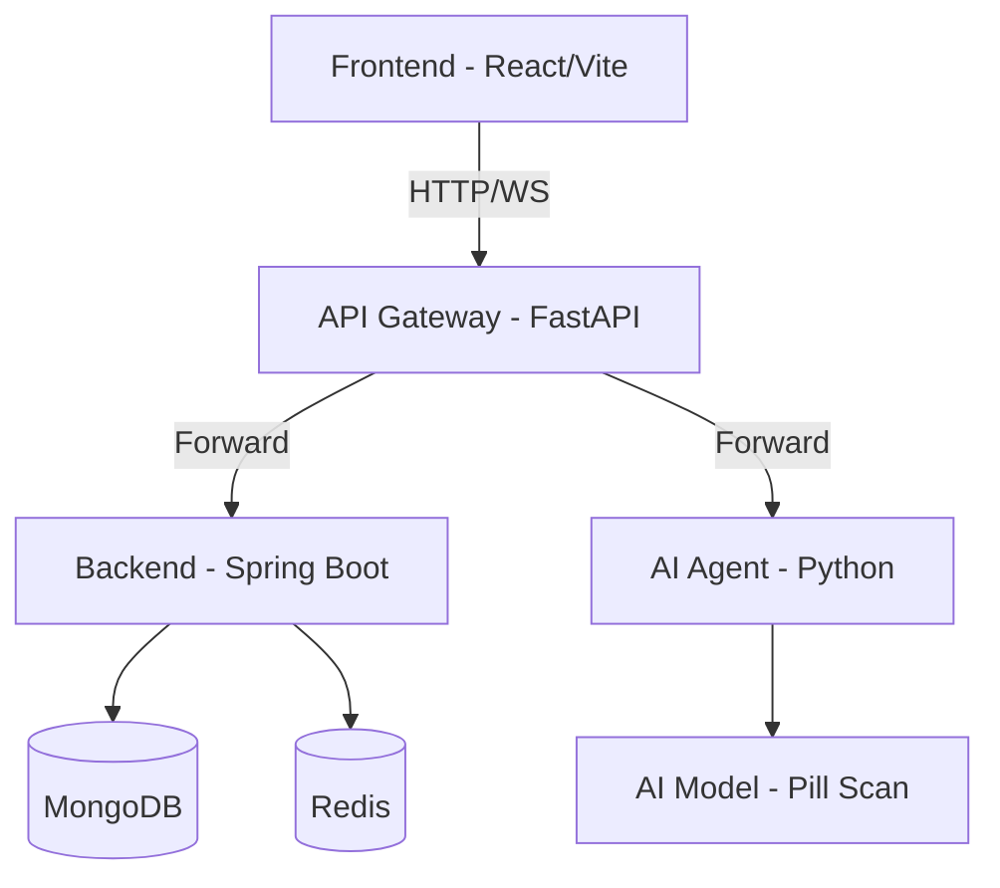
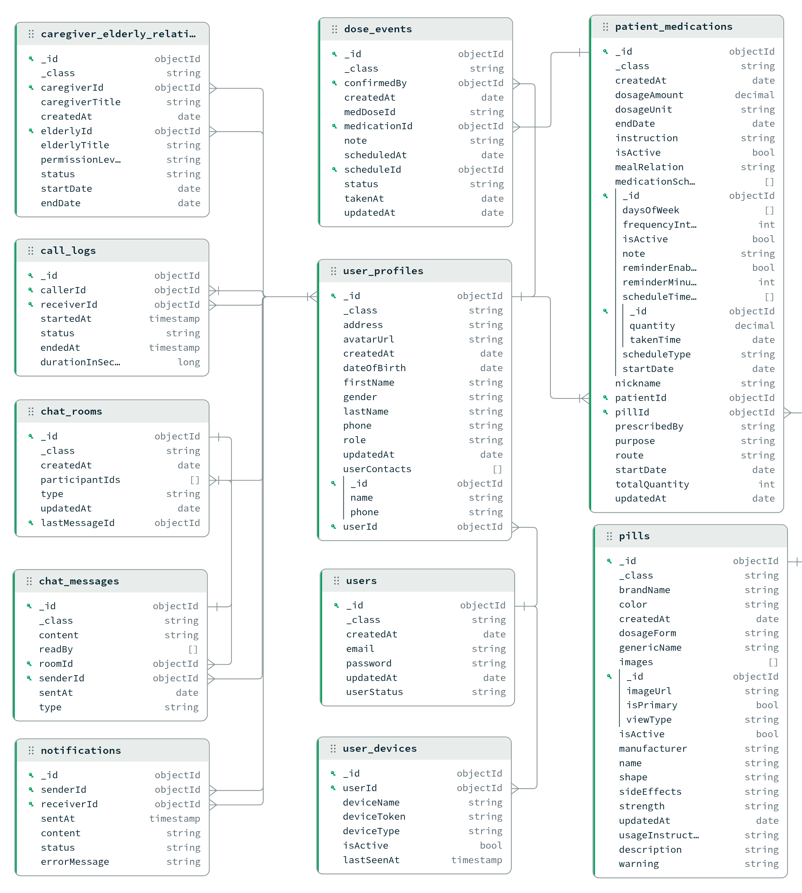

# PharmAgent - Hệ thống lên lịch và quản lý thuốc cho người cao tuổi

# I. Mở đầu
## 1. Lý do chọn đề tài.

Trong những năm gần đây, cùng với sự già hóa dân số toàn cầu, công nghệ y tế (HealthTech) đang trở thành một trong những lĩnh vực công nghệ thu hút sự quan tâm đặc biệt. Đối với người cao tuổi, việc mắc các bệnh lý nền và phải sử dụng nhiều loại thuốc với lịch trình phức tạp là rất phổ biến. Tuy nhiên, sự suy giảm trí nhớ và những hạn chế về mặt thể chất thường dẫn đến tình trạng quên uống thuốc, uống sai liều hoặc nhầm lẫn thuốc — gây ra những hậu quả nghiêm trọng đối với quá trình điều trị. Việc chuyển đổi từ các phương pháp nhắc nhở thủ công (như hộp chia thuốc, ghi chép giấy) sang các nền tảng kỹ thuật số thông minh là một nhu cầu cấp thiết để kết nối hiệu quả giữa bệnh nhân, người chăm sóc và hệ thống y tế.

Đặc điểm kỹ thuật của một hệ thống quản lý y tế cá nhân đặt ra nhiều bài toán phức tạp, đòi hỏi sự kết hợp của nhiều kiến trúc phần mềm hiện đại:

* **Về tính kịp thời và độ tin cậy của luồng thông báo:** Tính mạng và sức khỏe người dùng phụ thuộc vào việc hệ thống gửi lời nhắc uống thuốc phải chính xác đến từng phút. Việc điều phối và phát đi hàng ngàn thông báo đồng thời đòi hỏi hệ thống phải có cơ chế xử lý tác vụ bất đồng bộ (asynchronous processing) và sử dụng các hệ thống điều phối thông điệp (Message Broker) mạnh mẽ để không làm tắc nghẽn luồng xử lý chính của máy chủ.
* **Về tính linh hoạt trong quản lý dữ liệu:** Hồ sơ bệnh án, chi tiết đơn thuốc và lịch sử tuân thủ điều trị là những tập dữ liệu có tính đa dạng cao và liên tục mở rộng. Hệ thống yêu cầu một giải pháp cơ sở dữ liệu có khả năng mở rộng tốt, xử lý linh hoạt các cấu trúc dữ liệu phức tạp để lưu trữ và truy xuất thông tin bệnh nhân với hiệu năng cao.
* **Về bảo mật và xác thực danh tính:** Dữ liệu y tế và lịch sử dùng thuốc là những thông tin cá nhân cực kỳ nhạy cảm. Quá trình đăng nhập và thao tác trên hệ thống đòi hỏi các cơ chế bảo mật nghiêm ngặt, như xác thực đa yếu tố (MFA) hay mã xác thực một lần (OTP), đồng thời yêu cầu hệ thống phân quyền rõ ràng giữa các vai trò khác nhau như người dùng cao tuổi, người nhà (người giám hộ) và bác sĩ.

Nhóm lựa chọn đề tài xây dựng nền tảng **PharmAgent** vì đây là một bài toán thực tiễn mang tính nhân văn cao, đồng thời tạo ra một bối cảnh ứng dụng hoàn hảo để tổng hợp các kiến thức chuyên ngành: từ việc thiết kế luồng người dùng (User Flow), xây dựng RESTful API, quản trị cơ sở dữ liệu, đến xử lý bảo mật. Hơn thế nữa, đề tài cho phép nhóm trực tiếp làm quen và giải quyết các bài toán ở quy mô hệ thống doanh nghiệp (Enterprise Architecture) như tích hợp Message Queue, thiết kế dịch vụ chạy ngầm (Background Jobs) và triển khai các luồng xác thực an toàn.

## 2. Mục tiêu dự án

Dự án của chúng ta là **PharmAgent** — một hệ thống hỗ trợ y tế (HealthTech) tập trung vào người cao tuổi. với 4 mục tiêu kỹ thuật chính:

### Mục tiêu 1: Hệ thống quản lý và nhắc nhở uống thuốc thông minh
Xây dựng pipeline nhắc nhở tin cậy: từ việc thiết lập lịch trình đơn thuốc phức tạp, xử lý các tác vụ chạy ngầm (**Background Jobs**) để điều phối thông báo, đến việc gửi tín hiệu thời gian thực qua **WebSocket**. Hệ thống phải đảm bảo tính kịp thời (chính xác đến từng phút) và cho phép người dùng xác nhận, theo dõi lịch sử tuân thủ điều trị.

### Mục tiêu 2: Trợ lý AI nhận diện thuốc thời gian thực (Pill Scan)
Xây dựng **AI Agent** xử lý luồng dữ liệu hình ảnh/video từ camera để nhận diện các loại thuốc. Sử dụng kết nối **WebSocket** để truyền tải frame ảnh và trả về kết quả nhận diện (tên thuốc, hàm lượng, công dụng) với độ trễ thấp. Tích hợp lưu trữ hình ảnh nhận diện lên đám mây (**Cloudinary**) để làm bằng chứng tuân thủ.

### Mục tiêu 3: Hệ thống kết nối và giám sát Caregiver - Elderly
Xây dựng tính năng kết nối đa chiều giữa người cao tuổi và người chăm sóc (Caregiver). Đảm bảo sự đồng bộ trạng thái giữa các vai trò: người chăm sóc có thể quản lý danh mục thuốc, theo dõi việc uống thuốc của người thân từ xa và nhận cảnh báo tức thời nếu có sự cố hoặc quên liều.

### Mục tiêu 4: Kiến trúc Microservices và Bảo mật dữ liệu y tế
Triển khai hệ thống dựa trên kiến trúc **Microservices** hiện đại:
*   **API Gateway (FastAPI)**: Đóng vai trò cửa ngõ, xử lý xác thực tập trung, Rate Limiting và định tuyến.
*   **Backend (Spring Boot)**: Xử lý logic nghiệp vụ nặng và quản lý dữ liệu trên **MongoDB/MySQL**.
*   **Bảo mật**: Quản lý phiên bằng **JWT**, phân quyền **RBAC** nghiêm ngặt (Admin/Caregiver/Elderly) để bảo vệ dữ liệu y tế nhạy cảm của người dùng.

Hệ thống PharmAgent là giải pháp microservices hỗ trợ người cao tuổi theo dõi lịch uống thuốc, nhận diện thuốc qua AI và kết nối với người thân (caregiver).

## 3. Quy trình phối hợp và quản lý mã nguồn.

### 3.1. Gitflow
| Tên nhánh | Vai trò | 
| -- | -- | 
| `main` | Môi trường production - nhánh chứa mã nguồi cuối cùng cho môi trường sản phẩm |
| `dev` | Môi trường staging - nhánh dùng để tổng hợp code, kiểm thử trước khi đưa lên production | 
| `feat/cms-service` | Nhánh phát triển module quản lý nội dung |
| `feat/agent-service` | Nhánh phát triển module AI nhận diện thuốc |
| `feat/chat-service` | Nhánh phát triển module chat và thông báo thời gian thực |
| `feat/schedule-service` | Nhánh phát triển module quản lý lịch uống thuốc |
| `feat/frontend` | Nhánh phát triển giao diện người dùng (React) |
| `feat/api-gateway` | Nhánh phát triển API Gateway (FastAPI) |
| `feat/infrastructure` | Nhánh phát triển hạ tầng, Docker, CI/CD |

**Quy trình làm việc:**
1. Mỗi thành viên sẽ tạo nhánh riêng từ `dev` để phát triển tính năng mới hoặc sửa lỗi.
2. Sau khi hoàn thành, tạo Pull Request (PR) từ nhánh tính năng vào `dev` để được review và kiểm thử.
3. Sau khi PR được duyệt và merge vào `dev`, tiến hành kiểm thử tích hợp toàn bộ trên môi trường staging.
4. Khi mọi thứ ổn định, merge `dev` vào `main` để triển khai lên production.

### 3.2. Docker compose
Một trong những khó khăn phổ biến khi nhiều người cùng phát triển một hệ thống là
sự sai lệch về môi trường giữa các máy thành viên: khác phiên bản thư viện, khác cấu hình cơ
sở dữ liệu, hoặc thiếu dịch vụ phụ trợ. Để giải quyết vấn đề này, nhóm sử dụng Docker
Compose để định nghĩa và khởi chạy toàn bộ hệ thống như một tập hợp các container nhất
quán.

| Service | Image/Build | Port | Mô tả |
| -- | -- | -- | -- |
| `database` | `mongo:7` | 27017 | Cơ sở dữ liệu MongoDB, khởi tạo qua `init.sql` |
| `redis` | `redis:7-alpine` | 6379 | Hệ thống cache và message broker |
| `rabbitmq` | `rabbitmq:3-management` | 5672/15672 | Hệ thống message broker cho xử lý bất đồng bộ |
| `pharmagent-agent` | Build từ `./agent/` | 8000 | Dịch vụ AI nhận diện thuốc |
| `pharmagent-backend` | Build từ `./backend/` | 8080 | Dịch vụ backend chính xử lý logic nghiệp vụ |
| `pharmagent-gateway` | Build từ `./gateway/` | 9000 | API Gateway xử lý xác thực và định tuyến |
| `pharmagent-frontend` | Build từ `./frontend/` | 5173 | Giao diện người dùng React |
| `cloudflare` | `cloudflare/cloudflared:2024.6.0` | - | Dịch vụ tunneling để expose local server ra Internet |

Để đảm bảo tính bảo mật, chúng ta chỉ expose các cổng cần thiết ra bên ngoài (ví dụ: 5173 cho frontend, 9000 cho API Gateway) và giữ các dịch vụ nội bộ (database, redis, rabbitmq) chỉ có thể truy cập từ trong mạng Docker.

Với cấu hình này, mọi thành viên chỉ cần cài đặt Docker và chạy lệnh docker
compose up để có được một môi trường phát triển đầy đủ, bao gồm cơ sở dữ liệu đã được
khởi tạo dữ liệu mẫu. Các biến cấu hình nhạy cảm (kết nối cơ sở dữ liệu, API key) được quản
lý qua file .env riêng cho từng service, không được đưa lên repository.

Cloudinary hoạt động như một dịch vụ bên ngoài có chức năng lưu trữ hình ảnh nhận diện thuốc. Các container trong hệ thống sẽ kết nối với Cloudinary qua API để upload và truy xuất hình ảnh, đảm bảo tính linh hoạt và mở rộng của hệ thống.

### 3.3. Kiến trúc hệ thống

### 3.4. Phân chia công việc
- **Module A – UI & Gateway (BFF)**: Sở hữu toàn bộ UI (Elderly/Caregiver/Admin), luồng xác thực ở phía client, WebSocket client, và phần “BFF” ở Gateway (route, auth check, mapping payload). Đầu ra: UI hoàn chỉnh + spec API cần từ backend.
- **Module B – Core Backend (User/Caregiver/Medication/Schedule)**: Sở hữu domain chính (User/Caregiver, thuốc, lịch uống, xác nhận tuân thủ). Thiết kế schema dữ liệu, CRUD, validation, RBAC. Đầu ra: API ổn định + test nghiệp vụ.
- **Module C – AI Agent (Pill Scan)**: Sở hữu dịch vụ AI nhận diện thuốc (WS streaming, xử lý ảnh, trả kết quả, lưu minh chứng). Đầu ra: API/WS spec + service chạy độc lập + tài liệu tích hợp.
- **Module D – Platform & Infra (Async/DevOps)**: Sở hữu hạ tầng (Docker/K8s, CI/CD, cấu hình môi trường, logging/monitoring), cùng pipeline thông báo (message broker, job scheduler/worker). Đầu ra: môi trường dev/staging chạy ổn + cơ chế nhắc thuốc async.

# II. Nền tảng kỹ thuật và công nghệ
## 1. Database
Hệ thống sử dụng **MongoDB** làm cơ sở dữ liệu chính để lưu trữ thông tin người dùng, đơn thuốc, lịch uống và lịch sử tuân thủ. MongoDB được chọn vì khả năng lưu trữ linh hoạt, phù hợp dữ liệu phi cấu trúc và mở rộng tốt. Bên cạnh đó, **Redis** được dùng cho caching và quản lý phiên (session), giúp tăng tốc truy xuất và giảm tải cho MongoDB.

### Thiết kế schema MongoDB
- **User**: thông tin xác thực và trạng thái tài khoản.
- **UserProfile**: hồ sơ chi tiết người dùng (thông tin cá nhân, liên hệ, vai trò).
- **Relationship**: quan hệ caregiver–elderly, quyền truy cập và trạng thái.
- **UserDevice**: thiết bị đăng nhập phục vụ push/notification.
- **Pill**: danh mục thuốc chuẩn (mô tả, đặc điểm, hình ảnh).
- **Medication**: thuốc theo bệnh nhân, liều dùng và lịch uống gắn kèm.
- **EventDose**: nhật ký từng liều uống (lịch hẹn, đã uống/chưa, người xác nhận).
- **Notification**: thông báo giữa người dùng, trạng thái gửi/nhận.
- **ChatRoom**: phòng chat và danh sách thành viên.
- **ChatMessage**: tin nhắn trong phòng chat, trạng thái đã đọc.
- **CallLog**: lịch sử cuộc gọi, thời lượng và trạng thái.

### Các phần embedded trong MongoDB
- **UserProfile → UserContact**: danh bạ/đầu mối liên hệ đi kèm hồ sơ, ít khi truy vấn độc lập.
- **Medication → MedSchedule**: lịch uống là thuộc tính của từng đơn thuốc, không có vòng đời riêng.
- **Pill → PillImage**: ảnh thuốc là metadata phụ trợ, luôn đi cùng thuốc.

### Vì sao chọn embed thay vì tách entity riêng
- **Truy cập cùng lúc**: dữ liệu con thường được đọc chung với dữ liệu cha.
- **Vòng đời phụ thuộc**: dữ liệu con không tồn tại độc lập.
- **Atomic update**: cập nhật một document, tránh đồng bộ nhiều collection.
- **Giảm độ phức tạp**: ít collection và ít truy vấn hơn.

## 2. Redis
- **Vai trò chung**: lưu trữ dữ liệu ngắn hạn, truy cập cực nhanh, phục vụ bảo mật và realtime thay vì “cache dữ liệu nghiệp vụ” truyền thống.
- **JWT blacklist**: lưu token bị thu hồi với TTL bằng thời gian còn sống của token; giúp chặn ngay các token bị logout mà không phải chờ hết hạn.
- **OTP reset mật khẩu**: lưu OTP có TTL ngắn; xác thực xong thì xóa để chống replay; giảm tải DB và tránh lưu dấu vết lâu dài.
- **Trạng thái online**: lưu session/online flag theo user, TTL tự hết hạn; phù hợp realtime nhưng có thể “stale” nếu user rớt kết nối mà không kịp cập nhật.
- **Rate limiting**: dùng bộ đếm theo “cửa sổ thời gian” (fixed window) cho mỗi IP/user; ưu điểm đơn giản, hiệu quả; nhược điểm là ranh giới cửa sổ có thể tạo burst.

## 3. RabbitMQ
- **Vai trò chung**: tách luồng bất đồng bộ khỏi request chính và làm broker realtime cho WebSocket; giúp hệ thống không bị block khi xử lý tác vụ nặng/chậm.
- **OTP email queue**: backend chỉ “đẩy việc gửi mail” vào hàng đợi, worker xử lý nền; nếu worker down, queue giữ lại cho tới khi worker lên lại.
- **STOMP broker relay**: dùng RabbitMQ làm broker cho các kênh `/topic` và `/queue`; `/topic` cho pub/sub (chat), `/queue` cho point‑to‑point (call signaling).
- **Tính mở rộng**: broker relay giúp nhiều instance backend cùng publish/subscribe thống nhất; realtime không phụ thuộc vào một server đơn lẻ.
- **Giới hạn hiện tại**: chưa thấy pipeline nhắc thuốc dùng RabbitMQ trong code; phần này nếu cần thì phải bổ sung producer/consumer riêng.

## 4. Cloudinary
- **Vai trò chung**: lưu trữ hình ảnh nhận diện thuốc do AI Agent xử lý; cung cấp URL truy cập trực tiếp, hỗ trợ CDN và quản lý vòng đời ảnh.
- **Tích hợp**: AI Agent upload ảnh nhận diện lên Cloudinary qua API, nhận URL trả về; URL này được lưu trong MongoDB để làm bằng chứng tuân thủ.
- **Lợi ích**: giảm tải lưu trữ cho backend, tận dụng dịch vụ chuyên biệt cho media, đảm bảo hiệu năng truy cập và khả năng mở rộng linh hoạt.
## 5. Backend Spring Boot (core service)
- **Môi trường**: Java 21, Spring Boot 4.0.3, Maven.
- **Vai trò chính**:
  - Xử lý toàn bộ nghiệp vụ lõi (user, caregiver, medication, schedule, event).
  - Quản lý dữ liệu bền vững và các luồng đồng bộ.
  - Xác thực/ủy quyền JWT, kiểm soát truy cập theo vai trò.
  - Phục vụ realtime (STOMP/WebSocket) và tác vụ bất đồng bộ (RabbitMQ).
- **Thư viện & vai trò**:
  - **spring-boot-starter-web**: REST API cho nghiệp vụ.
  - **spring-boot-starter-security + jjwt**: xác thực JWT, RBAC.
  - **spring-boot-starter-data-mongodb**: lưu dữ liệu chính.
  - **spring-boot-starter-data-redis**: blacklist token, OTP, trạng thái online.
  - **spring-boot-starter-amqp**: hàng đợi bất đồng bộ.
  - **spring-boot-starter-mail**: gửi OTP qua email.
  - **spring-boot-starter-websocket**: STOMP endpoint cho chat/call.
  - **mapstruct + lombok**: mapping DTO, giảm boilerplate.
  - **validation**: ràng buộc dữ liệu request.
  - **actuator**: health/metrics.
  - **cloudinary**: lưu bằng chứng hình ảnh nhận diện thuốc.
- **Luồng xử lý nổi bật**:
  - **Auth**: JWT + blacklist Redis để thu hồi token tức thời.
  - **OTP**: tạo OTP → lưu Redis có TTL → đẩy job gửi mail qua RabbitMQ.
  - **Realtime**: gửi message vào broker STOMP → client subscribe theo topic/queue.
  - **Persistence**: MongoDB là nguồn dữ liệu chính; Redis chỉ giữ dữ liệu ngắn hạn.

## 6. Agent service (FastAPI) (Bổ xung sau)
## 7. API Gateway (FastAPI)
Mọi request từ Frontend phải gửi tới địa chỉ của Gateway (mặc định: `http://localhost:9000`). Gateway đóng vai trò:
- **Xác thực tập trung**: Kiểm tra tính hợp lệ của JWT.
- **Phân quyền (RBAC)**: Đảm bảo chỉ `ADMIN` mới vào được `/api/admin/**`, v.v.
- **Rate Limiting**: Giới hạn số lượng request để bảo vệ hệ thống.

### Danh sách Endpoint chính

| Chức năng | Phương thức | Path từ Frontend | Dịch vụ xử lý | Phân quyền |
| :--- | :--- | :--- | :--- | :--- |
| **Xác thực** | `POST` | `/api/auth/login` | Backend | Public |
| **Nhận diện thuốc (AI)** | `WS` | `/ws/agent` | AI Agent | Auth |
| **Quản lý người thân** | `GET/POST` | `/api/caregiver/**` | Backend | Caregiver |
| **Xác nhận uống thuốc** | `POST` | `/api/elderly/events/**` | Backend | Elderly |
| **Thông báo (STOMP)** | `WS` | `/ws/**` | Backend | Public/Auth |
| **Quản lý thuốc (CMS)** | `ALL` | `/api/admin/**` | Backend | Admin |

### Cơ chế truyền tin nội bộ
Khi Gateway forward request xuống dịch vụ đích, nó tự động đính kèm thông tin người dùng đã được xác thực:
- `X-User-Id`: ID của người dùng.
- `X-User-Roles`: Danh sách quyền (ví dụ: `ADMIN,CAREGIVER`).

## 8. Frontend (React) (Bổ xung sau)

## 9. Cloudflare Tunnel
Để expose local server ra Internet một cách an toàn, chúng ta sử dụng Cloudflare Tunnel. Dịch vụ này tạo một kết nối bảo mật từ máy local đến mạng Cloudflare, cho phép truy cập từ xa mà không cần mở cổng trên router hoặc lo lắng về bảo mật. Cấu hình trong `docker-compose.yml` sẽ khởi chạy container Cloudflare Tunnel cùng với các dịch vụ khác, đảm bảo rằng frontend và API Gateway có thể được truy cập từ Internet thông qua URL do Cloudflare cung cấp.

## 10. CI/CD.
- **Github Actions**: Tự động hóa quy trình build, test và deploy khi có thay đổi trên nhánh `main` hoặc `dev`.
- **Github Packages**: Lưu trữ image Docker đã build để dễ dàng triển khai lên môi trường staging/production.

