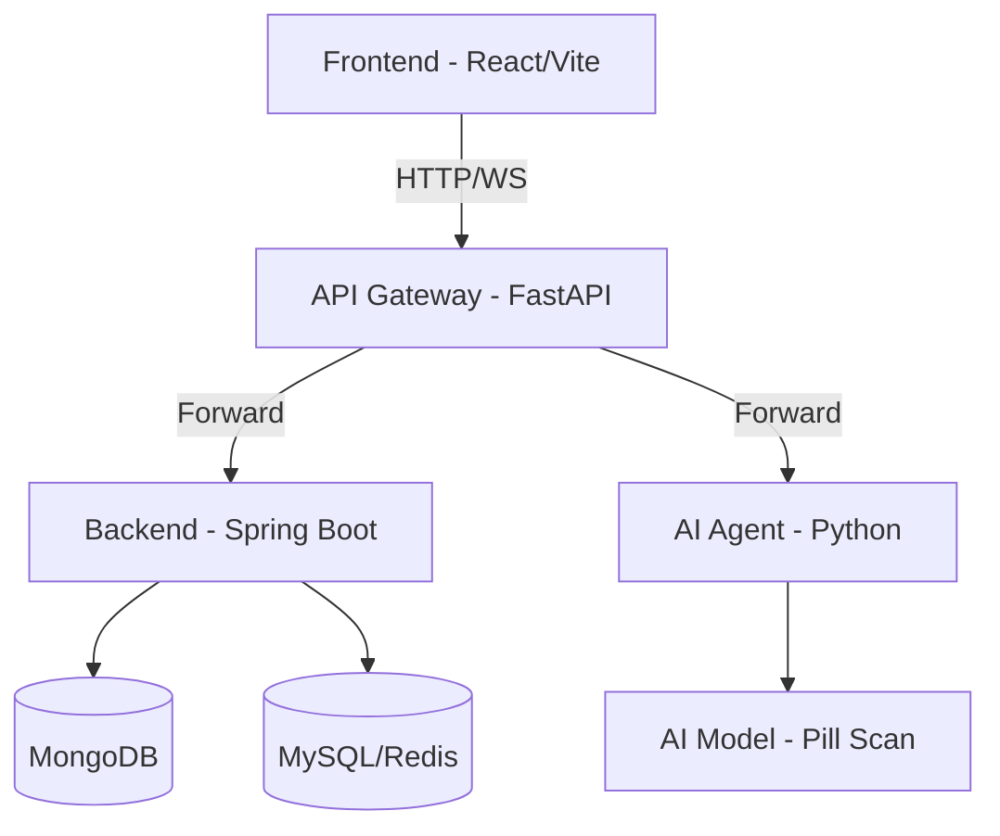

# PharmAgent - Hệ thống Quản lý và Hỗ trợ Uống thuốc Thông minh

Hệ thống PharmAgent là giải pháp microservices hỗ trợ người cao tuổi theo dõi lịch uống thuốc, nhận diện thuốc qua AI và kết nối với người thân (caregiver).

## 🏗 Kiến trúc hệ thống

---

## 🚦 Luồng API (Frontend → Gateway → Upstream)

### 1. Cổng kết nối (Gateway)
Mọi request từ Frontend phải gửi tới địa chỉ của Gateway (mặc định: `http://localhost:8000`). Gateway đóng vai trò:
- **Xác thực tập trung**: Kiểm tra tính hợp lệ của JWT.
- **Phân quyền (RBAC)**: Đảm bảo chỉ `ADMIN` mới vào được `/api/admin/**`, v.v.
- **Rate Limiting**: Giới hạn số lượng request để bảo vệ hệ thống.

### 2. Danh sách Endpoint chính

| Chức năng | Phương thức | Path từ Frontend | Dịch vụ xử lý | Phân quyền |
| :--- | :--- | :--- | :--- | :--- |
| **Xác thực** | `POST` | `/api/auth/login` | Backend | Public |
| **Nhận diện thuốc (AI)** | `WS` | `/ws/agent` | AI Agent | Auth |
| **Quản lý người thân** | `GET/POST` | `/api/caregiver/**` | Backend | Caregiver |
| **Xác nhận uống thuốc** | `POST` | `/api/elderly/events/**` | Backend | Elderly |
| **Thông báo (STOMP)** | `WS` | `/ws/**` | Backend | Public/Auth |
| **Quản lý thuốc (CMS)** | `ALL` | `/api/admin/**` | Backend | Admin |

### 3. Cơ chế truyền tin nội bộ
Khi Gateway forward request xuống dịch vụ đích, nó tự động đính kèm thông tin người dùng đã được xác thực:
- `X-User-Id`: ID của người dùng.
- `X-User-Roles`: Danh sách quyền (ví dụ: `ADMIN,CAREGIVER`).

---

## 📂 Cấu trúc mã nguồn

- [**gateway/**](file:///home/ngtukien/Documents/LTW_2026/PharmAgent/gateway/README.md): Cổng cửa ngõ, xử lý Security & Routing.
- [**backend/**](file:///home/ngtukien/Documents/LTW_2026/PharmAgent/backend/README.md): Logic nghiệp vụ chính (Spring Boot).
- [**agent/**](file:///home/ngtukien/Documents/LTW_2026/PharmAgent/agent/): Xử lý AI, nhận diện hình ảnh thuốc.
- [**frontend/**](file:///home/ngtukien/Documents/LTW_2026/PharmAgent/frontend/): Giao diện người dùng (React).

---

## 🚀 Hướng dẫn triển khai nhanh (Docker)

Hệ thống được đóng gói hoàn toàn bằng Docker Compose:

1. Copy file cấu hình mẫu: `cp .env.example .env`
2. Khởi chạy toàn bộ: `docker-compose up --build -d`
3. Truy cập:
   - Frontend: `http://localhost:5173`
   - API Gateway (Swagger): `http://localhost:8000/docs`
